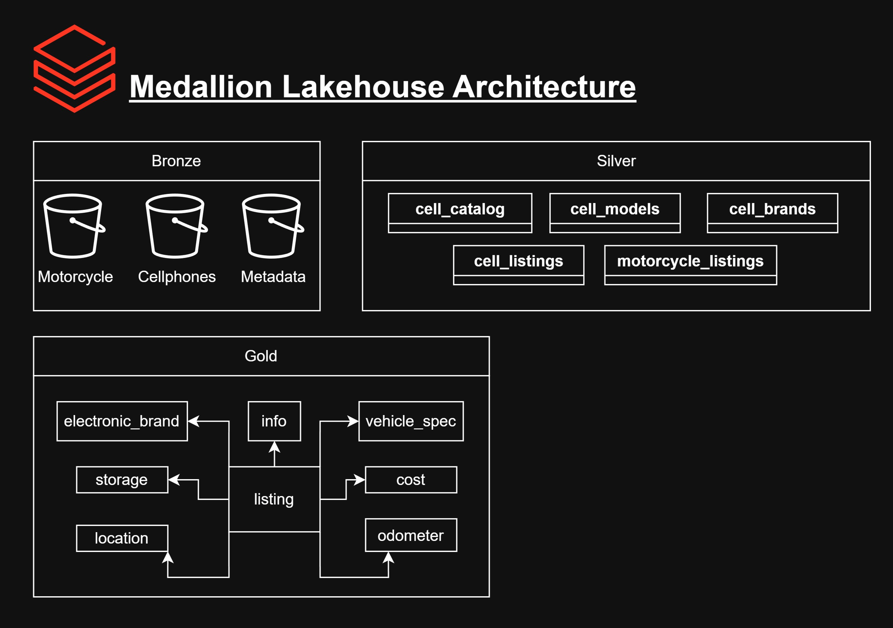
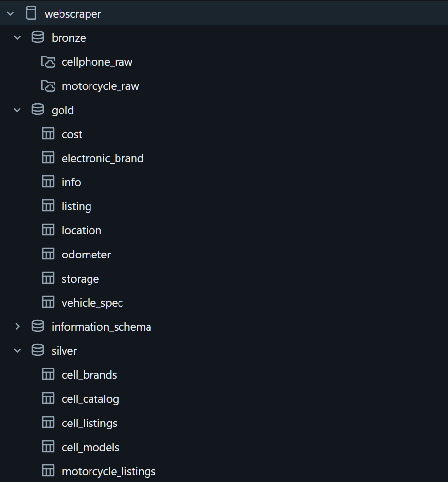
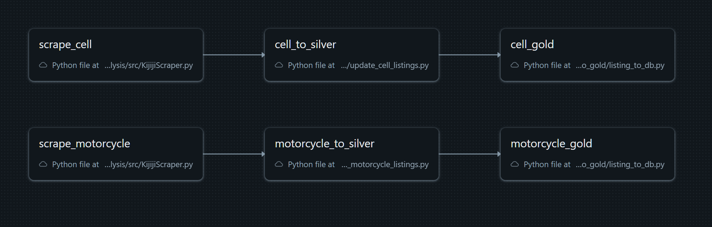
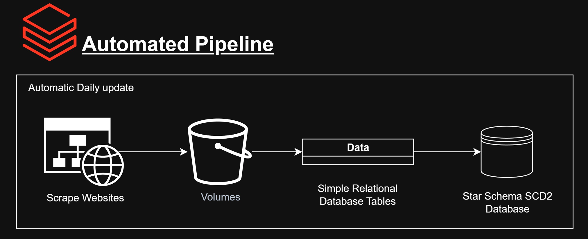

# UsedMarketAnalysis
A production-style, daily automated ELT pipeline that monitors second-hand listing prices, detects changes with SCD2 history, and serves clean analytics tables.

### Details
- Created a lightweight minimal intrusion webscraper (collects < 2k ads a day)
    - BeatuifulSoup +  requests + Multi-threading
- Cleaned and transformed data for data integrity
    - Pandas, SQL, Spark
- Designed databases with medallion architecture, slow changing dimensions, and star schema esk style.
    - SQL
- Automated pipelines to run once a day
    - Databricks

## Database Architecture



## Pipeline Overview



# Setup
The project is set up using conda to manage environments and python. To run, install conda and run this command:
```
conda env create -f environment.yml
```

# Folder Structure
### databricks
This directory contains notebooks and source for running scripts on Databricks. The *job* directory contains information regarding different processing operations (raw -> silver or silver -> gold). The *sql* directory has information about database structure and design.

### notebooks
This directory contains notebooks with verbose details to illustrate my thought process when inspecting and creating tools.


### src
This directory includes the code to execute the jobs.

### Kijiji Scraper All
This program goes through all the pages of a search and saves the data from each listing. Implemented multi-threading and achieved 10x performance limited by request block from site (30 min -> 3 minutes for 1600 listings)
- It uses requests to get the search page then goes to the links attached to each listing
- uses BeautifulSoup to parse the HTML
- program is multi-threaded with sleep back-off when too many requests are reported.

**NOTE**: must have data directory or else it will not save