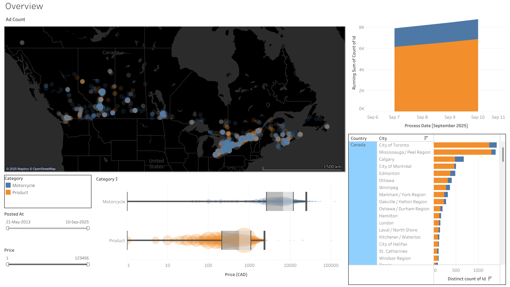
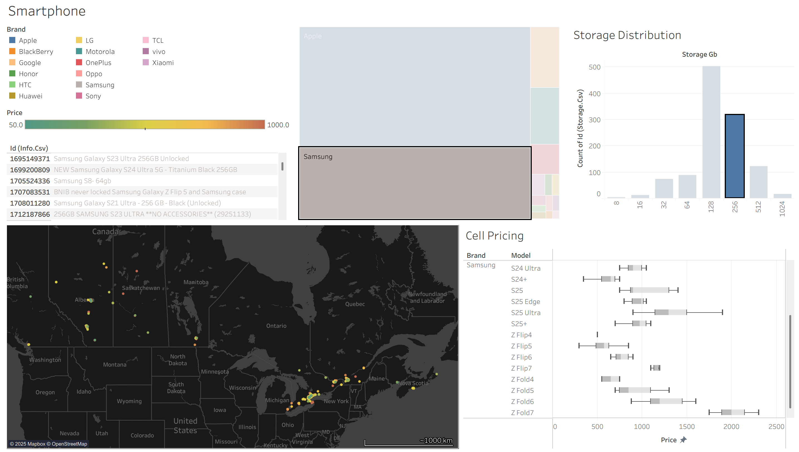

# UsedMarketAnalysis
A production-style, daily automated ELT pipeline that monitors second-hand listing prices, detects changes 
with SCD2 history, and serves clean analytics tables to Tableau.

### Dashboards



### Features
- Created a lightweight, minimal intrusion webscraper (collects < 2k ads a day)
    - BeatuifulSoup +  requests + Multi-threading
- Cleaned and transformed data for data integrity
    - Pandas, SQL, Spark
- Designed databases with medallion architecture, slow changing dimensions, and star schema esk style.
    - SQL
- Automated pipelines to run once a day
    - Databricks

## Database Architecture


## Pipeline Overview


# Setup
The project is set up using conda to manage environments and Python. To run, install conda and run this command:
```
conda env create -f environment.yml
```

# Folder Structure
### databricks
This folder contains
- notebooks
    - these are exploratory Jupyter notebook files
- job
    - The directory contains single-action jobs that pipelines utilize to automate actions.
- sql
    - The directory contains the database creation files.

### notebooks
- This folder contains data exploration

### src
- This folder contains reusable scripts for webscraping jobs.
